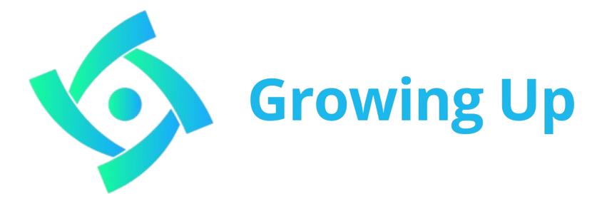

## QuickStarter

1. Clona el repositorio

        git clone https://github.com/HarielPS/growing-up.git

2. Haz npm install

        npm install

3. Corre el proyecto

        npm run dev

# Growing UP

*Impulsando tus sueños, construyendo futuro*

"Growing UP" es una plataforma de crowdfunding descentralizada en ZetaChain centrada en Bitcoin. Nuestro objetivo es conectar a inversores que buscan rendimientos en BTC con proyectos innovadores que necesitan financiación, proporcionando un entorno seguro y transparente.

## ¿Para Qué Sirve?
Growing UP permite a las empresas obtener el capital necesario para financiar diversos proyectos a través de inversiones colaborativas. Los inversores pueden participar en múltiples proyectos desde diferentes blockchains, asegurando así la diversificación y seguridad de sus inversiones.

Este es el link de nuestra página web:
[Growing Up](https://conexionemprendedora.z13.web.core.windows.net/)

[Video demostrativo](https://youtu.be/_0BpMj-AcPw)

# Contenido

* [Página Principal](#página-principal)
* [Inicio](#inicio)
* [Portafolio](#portafolio)
* [Historial](#historial)
* [Proyectos](#proyectos)
* [Propuesta de Valor](#propuesta-de-valor)
* [Características y Funcionalidades](#características-y-funcionalidades)
* [Colaboradores](#colaboradores)

## Página Principal

¿Cómo funciona? Bueno, tenemos varias secciones, pero veamos la primera vista que se nos muestra en cuanto se accede a la app.

Este espacio presenta información sobre nuestra aplicación y ofrece varias opciones para explorar su contenido, incluyendo:

- **Testimonios:** Descubre lo que nuestros clientes dicen de nuestros productos, destacando eficiencia, durabilidad y satisfacción.
  

- **Información sobre el Financiamiento:** Explicación de cómo Growing Up impulsa el crecimiento de las empresas mediante financiamiento rápido y transparente.
  

- **Sección de Ventajas:** Destaca las ventajas de invertir y ganar con Growing Up, incluyendo opciones de financiamiento seguro y oportunidades de inversión rentables.
  

Este espacio también ofrece acceso a preguntas frecuentes y proporciona información detallada sobre cómo utilizar la plataforma Growing Up para alcanzar los objetivos empresariales de manera ágil y transparente.

## Inicio
Proporciona una visión general del estado de la cuenta del usuario, inversiones y ganancias.

  

* **Visualización de Métricas:**
  - **Proyectos Activos:** Número de proyectos en curso en los que el usuario ha invertido.
  - **Inversiones Totales:** Monto total que el usuario ha invertido.
  - **Ganancias Totales:** Ganancias totales de todas las inversiones.
  - **Ganancias del Mes Actual:** Ganancias del mes actual.
  - **Próximos Pagos:** Total de pagos que se recibirán en el próximo mes.

* **Visualización Gráfica:**
  - **Gráfico de Línea:** Crecimiento de las inversiones totales a lo largo del tiempo.
  - **Gráfico de Pastel:** Desglose de las ganancias por categorías de proyectos.

## Portafolio
Proporciona información detallada sobre todas las inversiones y su estado.

* **Lista Detallada de Inversiones:**
  - Nombre del proyecto, monto de la inversión, ganancias obtenidas, próximo pago esperado y estado (por ejemplo, Al Corriente, Atrasado, Completado).
  - Categorías de proyectos y una breve descripción.

* **Visualización Gráfica:**
  - **Gráfico de Barras:** Inversiones por categorías de proyectos.
  - **Gráfico de Línea:** Rendimiento de inversiones individuales a lo largo del tiempo.

## Historial
Mostrar el historial de transacciones, incluidos los pagos y los cronogramas de inversión.

* **Lista de Transacciones:**
  - Listar todas las transacciones con fechas, montos y descripciones (por ejemplo, Inversión, Ganancias, Retiro).

* **Vista de Calendario:**
  - Resaltar las fechas de pagos futuros y transacciones pasadas.
  - Código de colores para diferentes tipos de transacciones (por ejemplo, Inversión, Ganancias).

* **Visualización Gráfica:**
  - **Gráfico de Línea:** Rastrear ganancias mensuales e inversiones a lo largo del tiempo.
  - **Gráfico de Pastel:** Desglose de tipos de transacciones.

## Proyectos
Mostrar los proyectos disponibles para inversión con información detallada.

  

* **Lista de Proyectos:**
  - Nombre del proyecto, descripción, categorías, monto necesario y estado actual de financiamiento.
  - Incluir objetivos del proyecto y retornos esperados.

* **Visualización Gráfica:**
  - **Barra de Progreso:** Mostrar el progreso de financiamiento para cada proyecto.
  - **Etiquetas de Categoría:** Etiquetas visuales para categorías de proyectos (por ejemplo, Tecnología, Salud).

## Propuesta de Valor

1. **Diversificación de Inversiones:** Los inversores pueden participar en múltiples proyectos de diferentes sectores y blockchains, aumentando las oportunidades de rendimiento.
2. **Mayor Seguridad:** La tokenización de activos reales como inmuebles, maquinaria e inventarios ofrece una garantía sólida para los inversores.
3. **Transparencia:** Todos los procesos están registrados en la blockchain, asegurando la trazabilidad y auditabilidad.
4. **Accesibilidad:** La plataforma facilita el acceso a financiación para proyectos innovadores que de otra manera tendrían dificultades para obtenerla.

## Características y Funcionalidades

1. **Registro y Verificación:**
   - Tanto los inversores como los proyectos deben registrarse y verificarse en la plataforma.
   - Los proyectos deben presentar un plan de negocio detallado y auditable.

2. **Creación de Campañas de Financiación:**
   - Los proyectos crean campañas estableciendo el monto a recaudar, el plazo y las condiciones.
   - Se detalla el uso de los fondos y se presentan las garantías ofrecidas.

3. **Inversión:**
   - Los inversores depositan BTC en un smart contract de la plataforma.
   - Los fondos se bloquean hasta que se cumplan las metas de financiación o finalice el plazo.

4. **Desembolso de Fondos:**
   - Una vez alcanzada la meta, los fondos se liberan al proyecto.
   - Se crea un token representativo de la deuda que el proyecto tiene con los inversores.

5. **Garantías y Recuperación de Inversiones:**
   - **Tokenización de Activos:** Los proyectos tokenizan activos reales y los depositan en un contrato inteligente. En caso de incumplimiento, los inversores pueden reclamar estos activos.
   - **Garantía Personal de los Fundadores:** Los fundadores del proyecto pueden ofrecer sus activos personales como garantía.
   - **Pignoración de Tokens:** Los proyectos pueden pignorar otros tokens que posean como garantía.
   - **Pools de Liquidez:** Los proyectos pueden aportar liquidez a pools de liquidez en protocolos de DeFi como garantía.
   - **Escrow Multisig:** Los fondos pueden ser custodiados en un contrato multisig requiriendo múltiples firmas para su liberación.

6. **Características Adicionales de la Plataforma:**
   - **Sistema de Reputación:** Se implementa un sistema de reputación para evaluar la confiabilidad de los proyectos y los inversores.
   - **Oracle:** Se utiliza un oráculo para obtener datos del mundo real y validar las garantías ofrecidas.
   - **Interfaz Intuitiva:** La plataforma tiene una interfaz fácil de usar para facilitar la participación de todos los usuarios.
   - **Token Nativo:** Se puede crear un token nativo para incentivar la participación en la plataforma y gobernar su funcionamiento.

## Colaboradores

* [@Jan](https://github.com/charlyguz) - Jan Acosta Becerril
* [@Marlon](https://github.com/Champagnepagcois) - Marlon Francois Rodriguez Cejudo
* [@Hariel](https://github.com/HarielPS) - Hariel Padilla Sanchez

